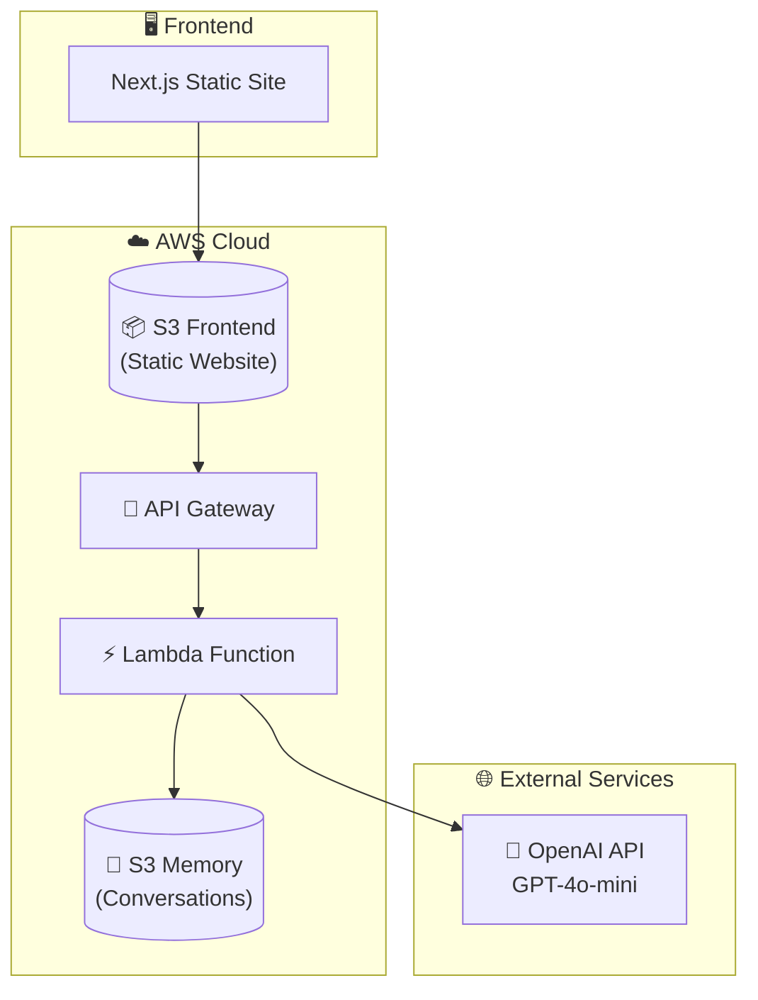
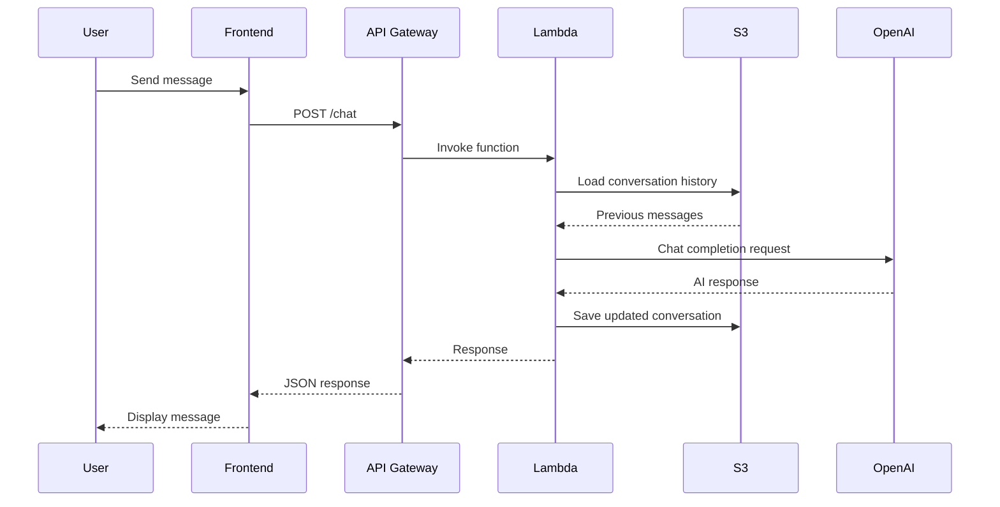
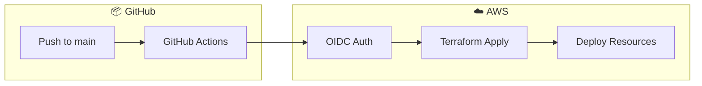

# 🤖 AI Digital Twin

An AI-powered Digital Twin chatbot that represents you on your personal/professional website. Built with FastAPI, OpenAI GPT-4o-mini, Next.js, and deployed to AWS using Terraform with GitHub Actions CI/CD.

## 📋 Table of Contents

- [Overview](#overview)
- [Architecture](#architecture)
- [Features](#features)
- [Project Structure](#project-structure)
- [Getting Started](#getting-started)
- [Local Development](#local-development)
- [AWS Deployment](#aws-deployment)
- [CI/CD with GitHub Actions](#cicd-with-github-actions)
- [Configuration](#configuration)
- [API Reference](#api-reference)

## Overview

This project creates a conversational AI agent that acts as your "digital twin" - an AI representation of yourself that can engage with website visitors, answer questions about your professional background, skills, and experience.

```
┌─────────────────────────────────────────────────────────────────┐
│                        🌐 Website Visitor                        │
└─────────────────────────────────────────────────────────────────┘
                                │
                                ▼
┌─────────────────────────────────────────────────────────────────┐
│                     💬 "Tell me about yourself"                  │
└─────────────────────────────────────────────────────────────────┘
                                │
                                ▼
┌─────────────────────────────────────────────────────────────────┐
│                       🤖 AI Digital Twin                         │
│                                                                  │
│   "Hi! I'm Kedarnadh. With 19+ years in cloud modernization     │
│    and software development, I've focused on data-driven         │
│    solutions and fostering collaboration..."                     │
└─────────────────────────────────────────────────────────────────┘
```

## Architecture

### High-Level Architecture



### Request Flow



### CI/CD Pipeline



## Features

- 🎭 **Personalized AI Responses** - Trained on your profile, LinkedIn, and communication style
- 💬 **Conversation Memory** - Maintains context across messages within a session
- 🔄 **Session Management** - Unique session IDs for each conversation
- ☁️ **Serverless Deployment** - Runs on AWS Lambda for cost-effective scaling
- 🏗️ **Infrastructure as Code** - Full Terraform configuration for AWS resources
- 🚀 **CI/CD Pipeline** - Automated deployments via GitHub Actions with OIDC authentication
- 🔒 **CORS Protected** - Secure cross-origin request handling
- 🖼️ **Custom Avatar** - Support for personalized avatar in chat interface

## Project Structure

```
twin/
├── .github/
│   └── workflows/
│       ├── deploy.yaml         # CI/CD deployment workflow
│       └── destroy.yaml        # Infrastructure teardown workflow
│
├── backend/
│   ├── server.py               # FastAPI application
│   ├── context.py              # AI prompt engineering
│   ├── resources.py            # Data loading utilities
│   ├── lambda_handler.py       # AWS Lambda entry point
│   ├── deploy.py               # Lambda packaging script
│   ├── requirements.txt        # Python dependencies
│   └── data/
│       ├── summary.txt         # Your professional summary
│       ├── style.txt           # Communication style notes
│       ├── facts.json          # Basic facts (name, etc.)
│       └── Profile.pdf         # LinkedIn profile export
│
├── frontend/
│   ├── app/
│   │   ├── layout.tsx          # Root layout
│   │   ├── page.tsx            # Homepage
│   │   └── globals.css         # Global styles
│   ├── components/
│   │   └── twin.tsx            # Chat component
│   ├── public/
│   │   └── avatar.png          # Your avatar image
│   ├── package.json            # Node.js dependencies
│   ├── next.config.mjs         # Next.js configuration
│   ├── tailwind.config.ts      # Tailwind CSS config
│   └── tsconfig.json           # TypeScript config
│
├── scripts/
│   ├── deploy.sh               # Deployment automation
│   └── destroy.sh              # Infrastructure teardown
│
├── terraform/
│   ├── bootstrap/              # One-time setup (run locally)
│   │   ├── main.tf             # S3 state, DynamoDB, OIDC, IAM role
│   │   └── README.md           # Bootstrap instructions
│   ├── main.tf                 # AWS resources definition
│   ├── variables.tf            # Input variables
│   ├── outputs.tf              # Output values
│   ├── versions.tf             # Provider configuration
│   ├── backend.tf              # S3 backend configuration
│   └── terraform.tfvars        # Variable values
│
├── .env.example                # Environment variables template
└── README.md
```

## Getting Started

### Prerequisites

- Python 3.12+
- [uv](https://github.com/astral-sh/uv) (Python package manager)
- Node.js 20+ (for frontend)
- AWS CLI configured
- Terraform 1.0+
- Podman or Docker (for Lambda packaging)
- OpenAI API key

### Environment Variables

Create a `.env` file in the `backend/` directory:

```env
OPENAI_API_KEY=sk-your-openai-api-key
CORS_ORIGINS=http://localhost:3000
USE_S3=false
MEMORY_DIR=../memory
```

## Local Development

### Backend

```bash
cd backend

# Initialize Python environment
uv init --bare
uv python pin 3.12
uv add -r requirements.txt

# Run the server
uv run uvicorn server:app --reload
```

The API will be available at `http://localhost:8000`

### Frontend

```bash
cd frontend

npm install
npm run dev
```

The frontend will be available at `http://localhost:3000`

## AWS Deployment

### One-Time Bootstrap Setup

Before using CI/CD, run the bootstrap to create prerequisite AWS resources:

```bash
cd terraform/bootstrap

terraform init
terraform apply -var="github_repository=YourUsername/twin"
```

This creates:
- S3 bucket for Terraform state
- DynamoDB table for state locking
- GitHub OIDC provider
- IAM role for GitHub Actions

### Add GitHub Secrets

After bootstrap, add these secrets to your GitHub repository (`Settings > Secrets > Actions`):

| Secret | Description |
|--------|-------------|
| `AWS_ROLE_ARN` | IAM role ARN (from bootstrap output) |
| `AWS_ACCOUNT_ID` | Your AWS account ID |
| `DEFAULT_AWS_REGION` | AWS region (e.g., `us-east-1`) |
| `OPENAI_API_KEY` | Your OpenAI API key |

### Manual Deploy

```bash
# Set your OpenAI API key
export TF_VAR_openai_api_key="sk-your-key-here"

# Deploy to AWS (default: dev environment)
./scripts/deploy.sh

# Deploy to test environment
./scripts/deploy.sh test

# Deploy to production
./scripts/deploy.sh prod
```

### What Gets Created

| Resource | Purpose |
|----------|---------|
| **S3 Frontend Bucket** | Hosts static website files |
| **S3 Memory Bucket** | Stores conversation history |
| **Lambda Function** | Runs the FastAPI backend |
| **API Gateway** | HTTP endpoints for the API |
| **IAM Role** | Permissions for Lambda |

### Teardown

```bash
# Destroy dev environment
./scripts/destroy.sh dev

# Destroy test environment
./scripts/destroy.sh test
```

## CI/CD with GitHub Actions

### Automatic Deployment

Push to `main` branch automatically triggers deployment to the `dev` environment.

### Manual Deployment

1. Go to **Actions** tab in GitHub
2. Select **Deploy Digital Twin** workflow
3. Click **Run workflow**
4. Select environment (`dev`, `test`, or `prod`)

### Manual Destroy

1. Go to **Actions** tab in GitHub
2. Select **Destroy Environment** workflow
3. Click **Run workflow**
4. Select environment and confirm by typing the environment name

## Configuration

### Customizing Your Digital Twin

1. **Edit `backend/data/summary.txt`** - Your professional summary
2. **Edit `backend/data/style.txt`** - Your communication style preferences
3. **Edit `backend/data/facts.json`** - Basic facts about you:
   ```json
   {
     "full_name": "Your Full Name",
     "name": "Your Preferred Name"
   }
   ```
4. **Add `backend/data/linkedin.pdf`** - Export of your LinkedIn profile
5. **Add `frontend/public/avatar.png`** - Your avatar image (displayed in chat)

### Terraform Variables

| Variable | Description | Default |
|----------|-------------|---------|
| `project_name` | Resource name prefix | `twin` |
| `environment` | Environment (dev/test/prod) | `dev` |
| `lambda_timeout` | Lambda timeout in seconds | `60` |
| `api_throttle_burst_limit` | API burst limit | `10` |
| `api_throttle_rate_limit` | API rate limit | `5` |
| `openai_api_key` | OpenAI API key | (required) |

## API Reference

### Endpoints

#### `GET /`
Returns API information.

```json
{
  "message": "AI Digital Twin API",
  "memory_enabled": true,
  "storage": "local"
}
```

#### `GET /health`
Health check endpoint.

```json
{
  "status": "healthy",
  "use_s3": false
}
```

#### `POST /chat`
Send a message to the Digital Twin.

**Request:**
```json
{
  "message": "Tell me about your experience",
  "session_id": "optional-session-id"
}
```

**Response:**
```json
{
  "response": "With over 19 years of experience...",
  "session_id": "generated-or-provided-id"
}
```

#### `GET /conversation/{session_id}`
Retrieve conversation history.

**Response:**
```json
{
  "session_id": "abc-123",
  "messages": [
    {
      "role": "user",
      "content": "Hello",
      "timestamp": "2025-01-15T10:30:00"
    },
    {
      "role": "assistant", 
      "content": "Hi! I'm Kedarnadh...",
      "timestamp": "2025-01-15T10:30:01"
    }
  ]
}
```

## 🔧 Troubleshooting

### Common Issues

| Issue | Solution |
|-------|----------|
| `S3 bucket does not exist` | Run bootstrap first: `cd terraform/bootstrap && terraform apply` |
| `Permission denied (publickey)` | Add your SSH key to GitHub |
| `OPENAI_API_KEY not set` | Add `OPENAI_API_KEY` to GitHub Secrets |
| `Frontend not loading` | Check if S3 bucket has files: `aws s3 ls s3://bucket-name/` |

## 📝 License

This project is for educational purposes as part of an AI deployment course.

## 🙏 Acknowledgments

- Built as part of the Agentic AI Production Deployment course
- Powered by OpenAI GPT-4o-mini
- Infrastructure managed with Terraform
- CI/CD via GitHub Actions with OIDC authentication
