# 🤖 AI Digital Twin

An AI-powered Digital Twin chatbot that represents you on your personal/professional website. Built with FastAPI, OpenAI GPT-4o-mini, and deployable to AWS using Terraform.

## 📋 Table of Contents

- [Overview](#overview)
- [Architecture](#architecture)
- [Features](#features)
- [Project Structure](#project-structure)
- [Getting Started](#getting-started)
- [Local Development](#local-development)
- [AWS Deployment](#aws-deployment)
- [Configuration](#configuration)
- [API Reference](#api-reference)

## Overview

This project creates a conversational AI agent that acts as your "digital twin" - an AI representation of yourself that can engage with website visitors, answer questions about your professional background, skills, and experience.

```
┌─────────────────────────────────────────────────────────────────┐
│                        🌐 Website Visitor                        │
└─────────────────────────────────────────────────────────────────┘
                                │
                                ▼
┌─────────────────────────────────────────────────────────────────┐
│                     💬 "Tell me about yourself"                  │
└─────────────────────────────────────────────────────────────────┘
                                │
                                ▼
┌─────────────────────────────────────────────────────────────────┐
│                       🤖 AI Digital Twin                         │
│                                                                  │
│   "Hi! I'm Kedarnadh. With 19+ years in cloud modernization     │
│    and software development, I've focused on data-driven         │
│    solutions and fostering collaboration..."                     │
└─────────────────────────────────────────────────────────────────┘
```

## Architecture

### High-Level Architecture

```mermaid
flowchart TB
    subgraph Client["🖥️ Frontend"]
        UI[Next.js Static Site]
    end

    subgraph AWS["☁️ AWS Cloud"]
        S3F[("📦 S3 Frontend\n(Static Website)")]
        APIGW[🔀 API Gateway]
        Lambda[⚡ Lambda Function]
        S3M[("💾 S3 Memory\n(Conversations)")]
    end

    subgraph External["🌐 External Services"]
        OpenAI[🧠 OpenAI API\nGPT-4o-mini]
    end

    UI --> S3F
    S3F --> APIGW
    APIGW --> Lambda
    Lambda --> S3M
    Lambda --> OpenAI
```



### Request Flow


### Local Development Architecture

```mermaid
flowchart LR
    subgraph Local["💻 Local Development"]
        FE[Frontend\nNext.js :3000]
        BE[Backend\nFastAPI :8000]
        MEM[("📁 Local Memory\n./memory/")]
    end

    subgraph External["🌐 External"]
        OAI[OpenAI API]
    end

    FE <-->|HTTP| BE
    BE <-->|Read/Write| MEM
    BE <-->|API Calls| OAI
```



## Features

- 🎭 **Personalized AI Responses** - Trained on your profile, LinkedIn, and communication style
- 💬 **Conversation Memory** - Maintains context across messages within a session
- 🔄 **Session Management** - Unique session IDs for each conversation
- ☁️ **Serverless Deployment** - Runs on AWS Lambda for cost-effective scaling
- 🏗️ **Infrastructure as Code** - Full Terraform configuration for AWS resources
- 🔒 **CORS Protected** - Secure cross-origin request handling

## Project Structure

```
twin/
├── backend/
│   ├── server.py           # FastAPI application
│   ├── context.py          # AI prompt engineering
│   ├── resources.py        # Data loading utilities
│   ├── lambda_handler.py   # AWS Lambda entry point
│   ├── deploy.py           # Lambda packaging script
│   ├── requirements.txt    # Python dependencies
│   └── data/
│       ├── summary.txt     # Your professional summary
│       ├── style.txt       # Communication style notes
│       ├── facts.json      # Basic facts (name, etc.)
│       └── Profile.pdf     # LinkedIn profile export
│
├── memory/                  # Local conversation storage
│   └── {session_id}.json
│
├── scripts/
│   ├── deploy.sh           # Deployment automation
│   └── destroy.sh          # Infrastructure teardown
│
├── terraform/
│   ├── main.tf             # AWS resources definition
│   ├── variables.tf        # Input variables
│   ├── outputs.tf          # Output values
│   ├── versions.tf         # Provider configuration
│   └── terraform.tfvars    # Variable values
│
└── README.md
```

## Getting Started

### Prerequisites

- Python 3.12+
- [uv](https://github.com/astral-sh/uv) (Python package manager)
- Node.js 18+ (for frontend)
- AWS CLI configured
- Terraform 1.0+
- Podman or Docker (for Lambda packaging)
- OpenAI API key

### Environment Variables

Create a `.env` file in the `backend/` directory:

```env
OPENAI_API_KEY=sk-your-openai-api-key
CORS_ORIGINS=http://localhost:3000
USE_S3=false
MEMORY_DIR=../memory
```

## Local Development

### Backend

```bash
cd backend

# Initialize Python environment
uv init --bare
uv python pin 3.12
uv add -r requirements.txt

# Run the server
uv run uvicorn server:app --reload
```

The API will be available at `http://localhost:8000`

### Frontend

```bash
cd frontend

npm install
npm run dev
```

The frontend will be available at `http://localhost:3000`

## AWS Deployment

### Quick Deploy

```bash
# Set your OpenAI API key
export TF_VAR_openai_api_key="sk-your-key-here"

# Deploy to AWS (default: dev environment)
./scripts/deploy.sh

# Deploy to test environment
./scripts/deploy.sh test

# Deploy to production
./scripts/deploy.sh prod
```

### What Gets Created

| Resource | Purpose |
|----------|---------|
| **S3 Frontend Bucket** | Hosts static website files |
| **S3 Memory Bucket** | Stores conversation history |
| **Lambda Function** | Runs the FastAPI backend |
| **API Gateway** | HTTP endpoints for the API |
| **IAM Role** | Permissions for Lambda |

### Teardown

```bash
# Destroy dev environment
./scripts/destroy.sh dev

# Destroy test environment
./scripts/destroy.sh test
```

## Configuration

### Customizing Your Digital Twin

1. **Edit `backend/data/summary.txt`** - Your professional summary
2. **Edit `backend/data/style.txt`** - Your communication style preferences
3. **Edit `backend/data/facts.json`** - Basic facts about you:
   ```json
   {
     "full_name": "Your Full Name",
     "name": "Your Preferred Name"
   }
   ```
4. **Add `backend/data/linkedin.pdf`** - Export of your LinkedIn profile

### Terraform Variables

| Variable | Description | Default |
|----------|-------------|---------|
| `project_name` | Resource name prefix | `twin` |
| `environment` | Environment (dev/test/prod) | `dev` |
| `lambda_timeout` | Lambda timeout in seconds | `60` |
| `api_throttle_burst_limit` | API burst limit | `10` |
| `api_throttle_rate_limit` | API rate limit | `5` |
| `openai_api_key` | OpenAI API key | (required) |

## API Reference

### Endpoints

#### `GET /`
Returns API information.

```json
{
  "message": "AI Digital Twin API",
  "memory_enabled": true,
  "storage": "local"
}
```

#### `GET /health`
Health check endpoint.

```json
{
  "status": "healthy",
  "use_s3": false
}
```

#### `POST /chat`
Send a message to the Digital Twin.

**Request:**
```json
{
  "message": "Tell me about your experience",
  "session_id": "optional-session-id"
}
```

**Response:**
```json
{
  "response": "With over 19 years of experience...",
  "session_id": "generated-or-provided-id"
}
```

#### `GET /conversation/{session_id}`
Retrieve conversation history.

**Response:**
```json
{
  "session_id": "abc-123",
  "messages": [
    {
      "role": "user",
      "content": "Hello",
      "timestamp": "2025-01-15T10:30:00"
    },
    {
      "role": "assistant", 
      "content": "Hi! I'm Kedarnadh...",
      "timestamp": "2025-01-15T10:30:01"
    }
  ]
}
```

## 📝 License

This project is for educational purposes as part of an AI deployment course.

## 🙏 Acknowledgments

- Built as part of the Agentic AI Production Deployment course
- Powered by OpenAI GPT-4o-mini
- Infrastructure managed with Terraform

